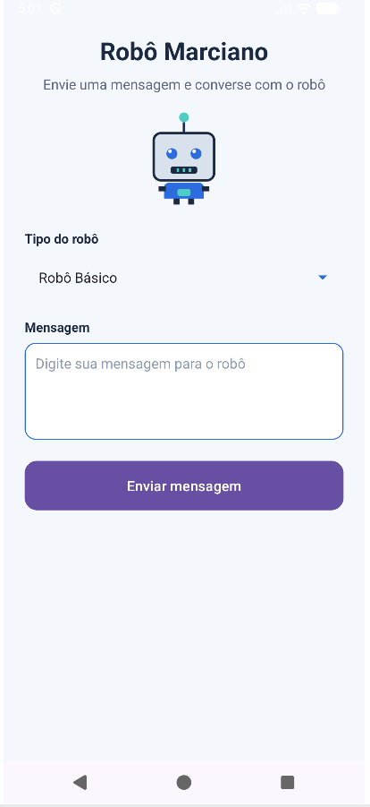
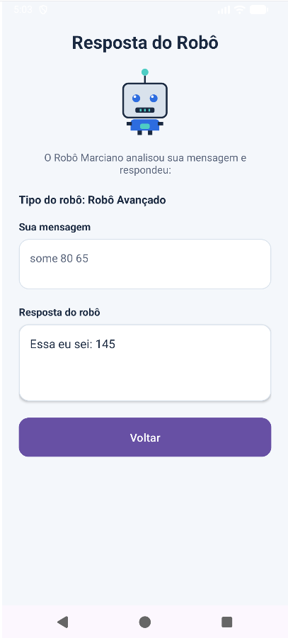

# Robô Marciano Android

<div align="left">

  <!-- robo-marciano-android_01.png -->
  <figure style="display: inline-block; margin: 0 15px; text-align: center;">
    
    <figcaption style="margin-top: 8px; font-size: 14px; color: #555;">Tela principal Robô Marciano Android</figcaption>
  </figure>

  <!-- robo-marciano-android_02.png -->
  <figure style="display: inline-block; margin: 0 15px; text-align: center;">
    
    <figcaption style="margin-top: 8px; font-size: 14px; color: #555;">Tela de respostas Robô Marciano Android</figcaption>
  </figure>

</div>

---

Aplicativo Android desenvolvido em Kotlin como adaptação mobile do projeto [Robô Marciano Kotlin](https://github.com/gismarb/robo-marciano-kotlin).

O objetivo do app é oferecer uma interface gráfica para interação com o Robô Marciano, permitindo que o usuário selecione o tipo de robô, envie mensagens e visualize a resposta em uma segunda tela.

Projeto desenvolvido para a atividade de Programação Mobile / Android.

---

## 1. Visão geral

O projeto **robo-marciano-android** transforma a lógica do [Robô Marciano Kotlin](https://github.com/gismarb/robo-marciano-kotlin), originalmente implementada para terminal, em um aplicativo Android com interface visual.

A aplicação permite:

- selecionar o tipo de robô;
- digitar uma mensagem;
- enviar a mensagem ao robô;
- visualizar a resposta em uma tela própria;
- retornar à tela principal para enviar novas perguntas;
- manter o campo de mensagem limpo ao retornar;
- executar regras específicas dos robôs básico, avançado e premium.

---

## 2. Tecnologias utilizadas

- **Kotlin**
- **Android Studio**
- **Android Views/XML**
- **ViewBinding**
- **Gradle Kotlin DSL**
- **JUnit 4**
- **Vector Drawable XML**
- **Git/GitHub**

---

## 3. Estrutura geral do projeto

```text
app/src/main/java/br/edu/ifmg/roboandroid
├── MainActivity.kt
├── AnswerActivity.kt
└── domain
    ├── model
    │   └── TipoRobo.kt
    ├── robot
    │   ├── Marciano.kt
    │   ├── MarcianoAvancado.kt
    │   ├── MarcianoPremium.kt
    │   └── RoboFactory.kt
    └── util
        └── UtilTexto.kt
```

```text
app/src/main/res
├── drawable
│   ├── bg_button_primary.xml
│   ├── bg_input_message.xml
│   ├── bg_response_card.xml
│   └── ic_robo_marciano.xml
├── layout
│   ├── activity_main.xml
│   └── activity_answer.xml
└── values
    ├── colors.xml
    ├── strings.xml
    └── themes.xml
```

```text
app/src/test/java/br/edu/ifmg/roboandroid/domain/robot
├── MarcianoTest.kt
├── MarcianoAvancadoTest.kt
└── MarcianoPremiumTest.kt
```

---

## 4. Funcionalidades implementadas

### 4.1 Tela principal

A tela principal permite ao usuário:

- escolher o tipo do robô em um `Spinner`;
- digitar uma mensagem em um `EditText`;
- enviar a mensagem usando um `Button`.

Tipos de robô disponíveis:

- Robô Básico;
- Robô Avançado;
- Robô Premium.

### 4.2 Tela de resposta

A tela de resposta apresenta:

- o tipo de robô selecionado;
- a mensagem enviada pelo usuário;
- a resposta calculada pela regra de negócio;
- botão para voltar à tela principal.

Ao voltar, a tela principal limpa o campo de mensagem e reposiciona o conteúdo no topo.

### 4.3 Regra de negócio

A regra de negócio foi separada da interface Android e organizada no pacote `domain`.

#### Robô Básico

A classe `Marciano` responde conforme a mensagem recebida:

| Entrada | Resposta |
|---|---|
| mensagem vazia, espaços ou quebras de linha | Não me incomode |
| pergunta + grito | Relaxa, eu sei o que estou fazendo! |
| grito | Opa! Calma aí! |
| pergunta | Certamente |
| contém a palavra “eu” | A responsabilidade é sua |
| demais casos | Tudo bem, como quiser |

#### Robô Avançado

A classe `MarcianoAvancado` herda as regras do básico e adiciona operações matemáticas:

| Comando | Exemplo | Resultado |
|---|---|---|
| some | `some 2 3` | Essa eu sei: 5 |
| subtraia | `subtraia 10 4` | Essa eu sei: 6 |
| multiplique | `multiplique 3 5` | Essa eu sei: 15 |
| divida | `divida 10 2` | Essa eu sei: 5 |

Também trata divisão por zero:

```text
divida 10 0
```

Resposta:

```text
Erro: não é possível dividir por zero
```

#### Robô Premium

A classe `MarcianoPremium` herda as regras do avançado e adiciona o comando:

```text
agir
```

Esse comando retorna:

```text
É pra já!
```

seguido de uma frase aleatória sobre tecnologia.

---

## 5. Decisões técnicas

### 5.1 Uso de duas Activities

Foram utilizadas duas telas principais:

- `MainActivity`: entrada da mensagem e seleção do tipo de robô;
- `AnswerActivity`: processamento da mensagem e exibição da resposta.

Essa escolha atende ao requisito de haver uma tela principal e uma tela de resposta.

### 5.2 Uso de ViewBinding

O projeto utiliza ViewBinding para acessar componentes XML de forma mais segura, evitando o uso manual de `findViewById`.

### 5.3 Separação entre interface e regra de negócio

A lógica do robô foi separada no pacote `domain`, evitando que as regras fiquem misturadas com as Activities.

Essa separação facilita:

- manutenção;
- testes;
- evolução;
- adaptação da lógica original do terminal para o Android.

### 5.4 Uso de Factory para criação do robô

A classe `RoboFactory` centraliza a criação do robô correto a partir do tipo selecionado na interface.

Com isso, a `AnswerActivity` não precisa conhecer os detalhes de instanciação de cada classe concreta. Ela apenas recebe o tipo escolhido, solicita a criação do robô e chama a regra de resposta.

### 5.5 Uso de herança para evolução dos tipos de robô

A estrutura dos robôs foi mantida de forma incremental:

```text
Marciano
└── MarcianoAvancado
    └── MarcianoPremium
```

Essa decisão preserva a ideia do projeto original:

- o Robô Básico possui as regras principais;
- o Robô Avançado reaproveita o Básico e adiciona operações matemáticas;
- o Robô Premium reaproveita o Avançado e adiciona o comando `agir`.

### 5.6 Adaptação do RoboSay

No [Robô Marciano Kotlin](https://github.com/gismarb/robo-marciano-kotlin), o robô era representado em ASCII no terminal.

Na versão Android, essa representação foi adaptada para uma imagem vetorial simples em XML (`ic_robo_marciano.xml`). A imagem foi criada como `Vector Drawable`, permitindo uso nativo no Android sem depender de imagens externas.

### 5.7 Tratamento de mensagem vazia pela regra de negócio

Durante o desenvolvimento, foi avaliada a possibilidade de validar mensagem vazia diretamente na `MainActivity`, usando um `Toast`.

A decisão final foi **não bloquear a mensagem vazia na interface**.

A `MainActivity` apenas coleta a entrada do usuário e envia para a `AnswerActivity`. A regra de negócio, localizada na classe `Marciano`, decide a resposta.

Assim, mensagens vazias, espaços e quebras de linha retornam:

```text
Não me incomode
```

Essa decisão foi tomada para preservar o comportamento lógico do robô original e reforçar a separação de responsabilidades:

- a interface coleta dados e controla navegação;
- a camada de domínio interpreta a mensagem e decide a resposta.

---

## 6. Testes automatizados

Foram adicionados testes unitários para validar a regra de negócio:

- `MarcianoTest.kt`
- `MarcianoAvancadoTest.kt`
- `MarcianoPremiumTest.kt`

Os testes validam:

- mensagem vazia;
- pergunta;
- grito;
- precedência entre pergunta e grito;
- palavra “eu”;
- operações matemáticas;
- divisão por zero;
- comando `agir`;
- frases aleatórias do premium;
- herança de comportamento entre os tipos de robô.

Para executar os testes:

```bash
./gradlew test
```

---

## 7. Como executar

No terminal, dentro da raiz do projeto:

```bash
./gradlew build
```

Para executar os testes:

```bash
./gradlew test
```

Para rodar o app:

1. abrir o projeto no Android Studio;
2. aguardar o Gradle Sync;
3. selecionar um emulador ou dispositivo físico;
4. clicar em **Run**.

---

## 8. Documentação complementar

A pasta `docs` contém documentação complementar do projeto:

- [Requisitos resumidos](docs/requisitos_resumidos.md)
- [Manual de execução](docs/manual_execucao.md)
- [Roteiro de testes](docs/roteiro_testes.md)

---

## 9. Referências técnicas

### Android e Kotlin

- [Android Developers — Documentação oficial](https://developer.android.com/docs)
- [Android Developers — Introdução ao Android Studio](https://developer.android.com/studio/intro)
- [Android Developers — App fundamentals](https://developer.android.com/guide/components/fundamentals)
- [Android Developers — Activities](https://developer.android.com/guide/components/activities/intro-activities)
- [Android Developers — Intents e Intent Filters](https://developer.android.com/guide/components/intents-filters)
- [Android Developers — Layouts](https://developer.android.com/develop/ui/views/layout/declaring-layout)
- [Android Developers — App resources](https://developer.android.com/guide/topics/resources/providing-resources)
- [Android Developers — String resources](https://developer.android.com/guide/topics/resources/string-resource)
- [Android Developers — ViewBinding](https://developer.android.com/topic/libraries/view-binding)
- [Android Developers — Vector Drawables](https://developer.android.com/develop/ui/views/graphics/vector-drawable-resources)
- [Kotlin — Documentação oficial](https://kotlinlang.org/docs/home.html)
- [Kotlin — Classes e herança](https://kotlinlang.org/docs/inheritance.html)
- [Kotlin — Object declarations](https://kotlinlang.org/docs/object-declarations.html)

### Build, testes e versionamento

- [Gradle — User Manual](https://docs.gradle.org/current/userguide/userguide.html)
- [Android Developers — Android Gradle Plugin](https://developer.android.com/build)
- [JUnit 4 — Documentação](https://junit.org/junit4/)
- [Git — Documentação oficial](https://git-scm.com/doc)
- [GitHub Docs — Getting started](https://docs.github.com/en/get-started)
- [Conventional Commits](https://www.conventionalcommits.org/)

### Arquitetura, organização e boas práticas

- [Android Developers — Guide to app architecture](https://developer.android.com/topic/architecture)
- [Android Developers — Test apps on Android](https://developer.android.com/training/testing)
- [Martin Fowler — Refactoring](https://martinfowler.com/books/refactoring.html)
- [Refactoring Guru — Factory Method](https://refactoring.guru/design-patterns/factory-method)
- [Refactoring Guru — Strategy](https://refactoring.guru/design-patterns/strategy)

### Projeto base anterior

- [Robô Marciano Kotlin](https://github.com/gismarb/robo-marciano-kotlin)

---

## 10. Status atual

MVP obrigatório implementado:

- tela principal;
- tela de resposta;
- seleção de tipo de robô;
- integração com regra real;
- campo limpo ao retornar;
- retorno por botão do app e botão voltar do Android;
- identidade visual básica;
- robô vetorial;
- testes unitários da regra de negócio.

Itens planejados para evolução:

- histórico de comandos;
- tela intermediária para operações matemáticas;
- persistência local do histórico;
- melhoria da experiência em formato de conversa.
